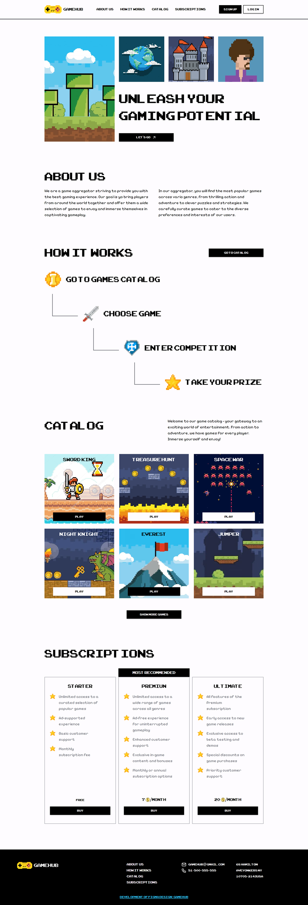

# GameHub Figma Design Implementation with Astro

[](https://65397c5ce545fe25f1f85848--extraordinary-concha-6924a8.netlify.app/)

## Overview

GameHub is a web application that brings a stunning Figma design to life using the Astro framework. This project showcases the seamless transition from design to development by implementing a visually appealing user interface originally found in Figma.

### Features

- **Responsive Design:** The project is designed to work flawlessly on various screen sizes, from desktop to mobile.

- **Performance Metrics:**
  - **Performance:** Achieves a Lighthouse performance score of 95%.
  - **Accessibility:** Attains a Lighthouse accessibility score of 100.
  - **Best Practices:** Meets Lighthouse best practices with a score of 95.
  - **SEO:** Excels in SEO optimization, earning a Lighthouse score of 100.

## Getting Started

To run this project locally, follow these steps:

1. Clone the repository:

   ```bash
   git clone https://github.com/danpvlz/gamehub.git

2. Enter the project

   ```bash
   cd gamehub

3. Install dependencies

   ```bash
   pnpm install

4. Start project

   ```bash
   pnpm run dev
